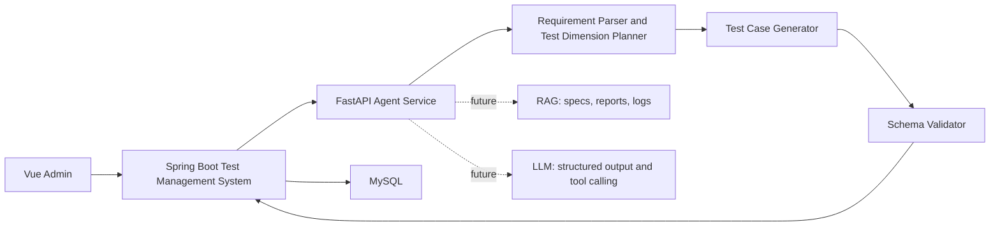

# AI Test Case Generation Agent Roadmap

## Positioning

Upgrade the existing test management system into an AI TestOps platform. The
first milestone is a test case generation agent.

The user enters a requirement, defect description, or test goal. The agent
decomposes it into test dimensions, generates structured test cases, and returns
candidate cases for human review before they are saved into the existing
`ceshiyongli` module.

## Generation Pipeline

1. Requirement parsing: extract module, role, action, business rule, constraint,
   and risk keywords.
2. Test dimension expansion: happy path, negative input, boundary value,
   permission, compatibility, reliability, performance, and data consistency.
3. Structured generation: each case must include title, priority, preconditions,
   steps, expected result, test data, risk point, and traceability.
4. Validation: check required fields, executable steps, valid priorities, and
   requirement traceability.
5. Human review: generated cases are reviewed before they enter the production
   test case table.

## Architecture

## Stack

- Existing system: Spring Boot 2.2, Vue, Element UI, MyBatis Plus, MySQL
- Agent service: Python, FastAPI, Pydantic
- LLM: OpenAI-compatible API or local model gateway
- RAG: Chroma, Milvus, or pgvector
- Document parsing: Markdown, TXT, PDF, Word
- Report generation: Markdown to Word/PDF or Apache POI

## Milestones

1. Local demo: `agent-service` exposes `/api/agents/test-cases/generate`.
2. Spring Boot integration: add a controller that calls the agent service.
3. LLM integration: use structured output and validation.
4. RAG integration: retrieve test specs, historical reports, and log samples.
5. Interview package: prepare architecture diagram, demo data, API examples,
   screenshots, and a concise project story.

