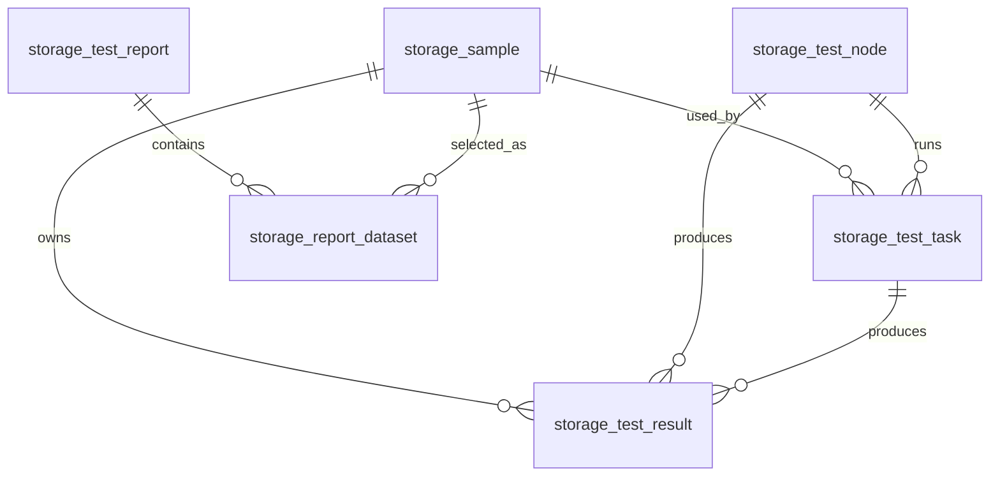

# 存储性能 TestOps 数据库设计

本文对应 `db/storage_testops_schema.sql` 与 `db/storage_testops_seed.sql`，用于后续的样例、节点、任务、结果、报表和 Agent 解析记录。

## 1. 表清单

- `storage_sample`：样品表
- `storage_test_node`：测试节点表
- `storage_test_case`：测试用例表
- `storage_test_task`：测试任务表
- `storage_test_result`：测试结果表
- `storage_test_report`：报表表
- `storage_report_dataset`：报表数据集表
- `storage_agent_request`：Agent 解析记录表

## 2. 核心关系

## 3. 状态枚举

### 3.1 节点状态

- `IDLE`：空闲
- `BUSY`：运行中
- `OFFLINE`：离线

### 3.2 手机连接状态

- `CONNECTED`：已连接
- `NOT_CONNECTED`：未连接
- `ERROR`：连接异常

### 3.3 ADB 状态

- `DEVICE`：设备可用
- `UNAUTHORIZED`：未授权
- `OFFLINE`：ADB offline
- `NOT_FOUND`：未发现设备

### 3.4 任务状态

- `DRAFT`：待确认
- `CONFIRMED`：已确认
- `QUEUED`：待执行
- `RUNNING`：执行中
- `COMPLETED`：已完成
- `FAILED`：失败

### 3.5 结果状态

- `PASS`：通过
- `WARNING`：警告
- `FAIL`：失败
- `N_A`：无法计算或数据不足

### 3.6 报告状态

- `DRAFT`：草稿
- `GENERATING`：生成中
- `COMPLETED`：已完成
- `FAILED`：失败

## 4. 设计说明

1. 报表模块直接依赖 `storage_test_result`，不依赖任务执行过程本身。
2. 任务表负责执行流程，结果表负责沉淀可查询数据。
3. 节点表保存节点状态、手机连接状态和 ADB 状态，便于调度与校验。
4. 种子数据包含：
   - WM6000 V2.0.3 baseline
   - WM6000 V2.0.4 target
   - 2730AB competitor
   - Node-1 到 Node-4
   - CDM、AS SSD、FIO 的 14 条测试用例

## 5. Seed 数据校验点

- `storage_sample`：3 条
- `storage_test_node`：4 条
- `storage_test_case`：14 条
