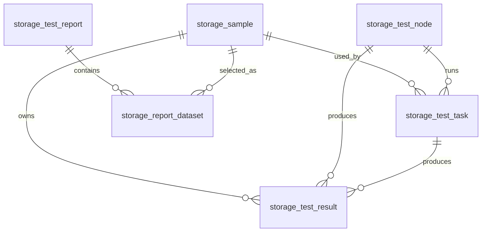

# 瀛樺偍鎬ц兘 TestOps 鏁版嵁搴撹璁?
鏈枃瀵瑰簲 `db/storage_testops_schema.sql` 涓?`db/storage_testops_seed.sql`锛岀敤浜庡悗缁殑鏍蜂緥銆佽妭鐐广€佷换鍔°€佺粨鏋溿€佹姤琛ㄥ拰 Agent 瑙ｆ瀽璁板綍銆?
## 1. 琛ㄦ竻鍗?
- `storage_sample`锛氭牱鍝佽〃
- `storage_test_node`锛氭祴璇曡妭鐐硅〃
- `storage_test_case`锛氭祴璇曠敤渚嬭〃
- `storage_test_task`锛氭祴璇曚换鍔¤〃
- `storage_test_result`锛氭祴璇曠粨鏋滆〃
- `storage_test_report`锛氭姤琛ㄨ〃
- `storage_report_dataset`锛氭姤琛ㄦ暟鎹泦琛?- `storage_agent_request`锛欰gent 瑙ｆ瀽璁板綍琛?
## 2. 鏍稿績鍏崇郴

## 3. 鐘舵€佹灇涓?
### 3.1 鑺傜偣鐘舵€?
- `IDLE`锛氱┖闂?- `BUSY`锛氳繍琛屼腑
- `OFFLINE`锛氱绾?
### 3.2 鎵嬫満杩炴帴鐘舵€?
- `CONNECTED`锛氬凡杩炴帴
- `NOT_CONNECTED`锛氭湭杩炴帴
- `ERROR`锛氳繛鎺ュ紓甯?
### 3.3 ADB 鐘舵€?
- `DEVICE`锛氳澶囧彲鐢?- `UNAUTHORIZED`锛氭湭鎺堟潈
- `OFFLINE`锛欰DB offline
- `NOT_FOUND`锛氭湭鍙戠幇璁惧

### 3.4 浠诲姟鐘舵€?
- `DRAFT`锛氬緟纭
- `CONFIRMED`锛氬凡纭
- `QUEUED`锛氬緟鎵ц
- `RUNNING`锛氭墽琛屼腑
- `COMPLETED`锛氬凡瀹屾垚
- `FAILED`锛氬け璐?
### 3.5 缁撴灉鐘舵€?
- `PASS`锛氶€氳繃
- `WARNING`锛氳鍛?- `FAIL`锛氬け璐?- `N_A`锛氭棤娉曡绠楁垨鏁版嵁涓嶈冻

### 3.6 鎶ュ憡鐘舵€?
- `DRAFT`锛氳崏绋?- `GENERATING`锛氱敓鎴愪腑
- `COMPLETED`锛氬凡瀹屾垚
- `FAILED`锛氬け璐?
## 4. 璁捐璇存槑

1. 鎶ヨ〃妯″潡鐩存帴渚濊禆 `storage_test_result`锛屼笉渚濊禆浠诲姟鎵ц杩囩▼鏈韩銆?2. 浠诲姟琛ㄨ礋璐ｆ墽琛屾祦绋嬶紝缁撴灉琛ㄨ礋璐ｆ矇娣€鍙煡璇㈡暟鎹€?3. 鑺傜偣琛ㄤ繚瀛樿妭鐐圭姸鎬併€佹墜鏈鸿繛鎺ョ姸鎬佸拰 ADB 鐘舵€侊紝渚夸簬璋冨害涓庢牎楠屻€?4. 绉嶅瓙鏁版嵁鍖呭惈锛?   - Project-A FW-v1 baseline
   - Project-A FW-v2 target
   - Competitor-X competitor
   - Node-1 鍒?Node-4
   - CDM銆丄S SSD銆丗IO 鐨?14 鏉℃祴璇曠敤渚?
## 5. Seed 鏁版嵁鏍￠獙鐐?
- `storage_sample`锛? 鏉?- `storage_test_node`锛? 鏉?- `storage_test_case`锛?4 鏉?