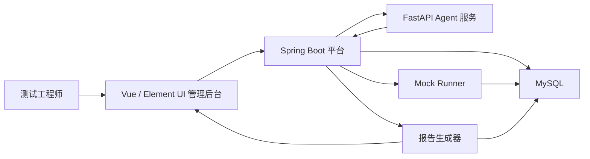
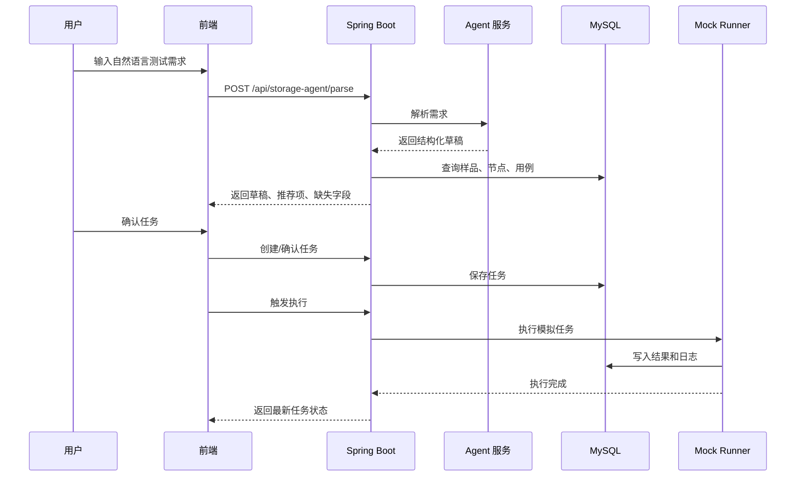
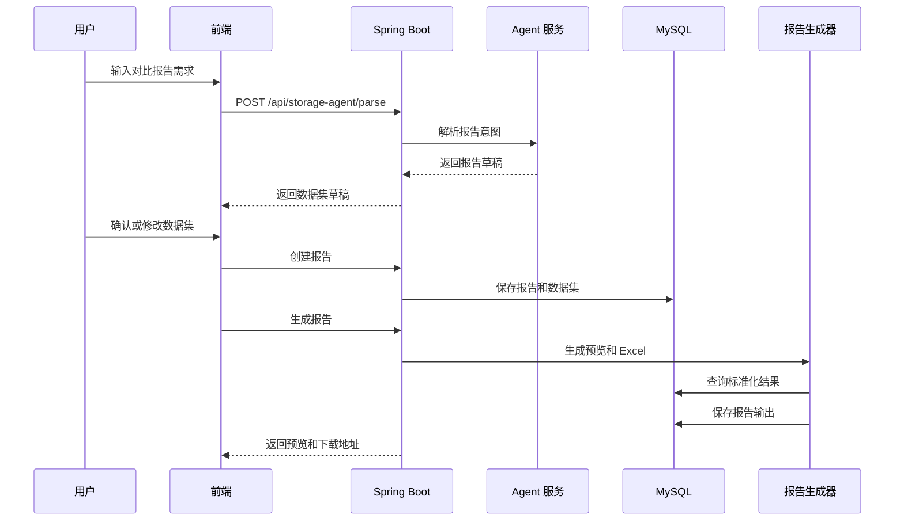
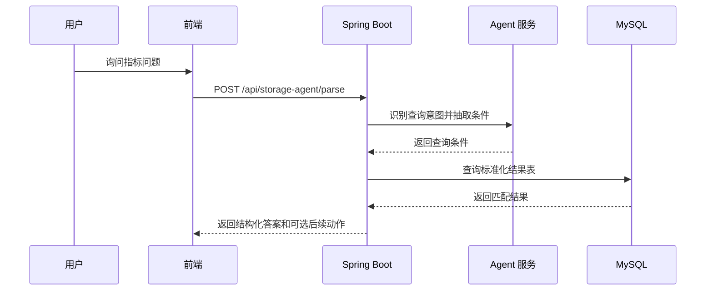

# AI 存储性能测试管理平台技术设计

## 1. 概述

本文档描述如何将现有 Spring Boot 测试管理系统升级为 AI 辅助的存储性能 TestOps 平台。

第一版重点实现：

- 自然语言任务与报告入口
- 结构化测试任务草稿
- 结构化报告草稿
- 存储样品、节点、用例、任务、结果和报告模型
- Mock Runner 模拟执行
- 基于标准化测试结果的独立报告生成
- 基础测试数据问答
- Excel 导出

设计上明确区分“测试执行”和“报告生成”。报告可以来自单个任务、多个任务、历史数据、竞品数据或手动导入数据，不强绑定某一次执行。

## 2. 总体架构



## 3. 模块职责

### 3.1 前端管理后台

职责：

- 自然语言输入
- 测试任务草稿确认
- 报告草稿确认
- 样品、节点、用例管理
- 任务状态展示
- 报告预览和 Excel 下载

### 3.2 Spring Boot 平台

职责：

- 提供可信业务 API
- 数据库访问
- 测试任务创建和状态流转
- 节点、手机连接、ADB 状态校验
- Mock Runner 调度
- 测试结果查询
- 报告生成
- Excel 文件下载

### 3.3 FastAPI Agent 服务

职责：

- 意图识别
- 字段抽取
- 缺失字段识别
- 输出结构化 JSON
- 用例和节点推荐规则
- 测试数据查询意图解析
- 后续接入 LLM、RAG 和工具调用

### 3.4 Mock Runner

职责：

- 模拟节点执行
- 生成多轮性能数据
- 生成 pass/warning/fail 结果
- 生成执行日志
- 写入标准化结果表
- 模拟失败场景

### 3.5 报告生成器

职责：

- 查询报告数据集
- 查询标准化测试结果
- 计算平均值和差异百分比
- 应用 warning/fail 阈值
- 生成网页预览 JSON
- 使用 Apache POI 填充 Excel 模板
- 保存报告文件路径

## 4. 核心流程

### 4.1 创建测试任务



### 4.2 生成报告



### 4.3 查询测试指标



## 5. 数据模型

### 5.1 `storage_test_node`

表示测试执行节点，也就是实验室里的小电脑。

关键字段：

- `id`
- `node_code`
- `node_name`
- `ip_address`
- `node_status`：`IDLE`、`BUSY`、`OFFLINE`
- `phone_status`：`CONNECTED`、`NOT_CONNECTED`、`ERROR`
- `adb_state`：`DEVICE`、`UNAUTHORIZED`、`OFFLINE`、`NOT_FOUND`
- `device_serial`
- `current_sample_id`
- `capabilities`
- `last_heartbeat_time`
- `last_adb_check_time`

### 5.2 `storage_sample`

表示 DUT、样品或竞品样品。

关键字段：

- `id`
- `project_name`
- `soc`
- `particle`
- `capacity`
- `fw_version`
- `sample_code`
- `batch_no`
- `sample_type`：`SELF`、`BASELINE`、`COMPETITOR`
- `remark`

### 5.3 `storage_test_case`

表示 CDM、AS SSD、FIO 的标准用例或指标。

关键字段：

- `id`
- `case_name`
- `suite`：`CDM`、`AS_SSD`、`FIO`
- `scene`：`clean`、`dirty`
- `metric_name`
- `unit`
- `priority`
- `command_template`
- `enabled`

### 5.4 `storage_test_task`

表示测试执行任务。该表只负责执行流程，不是报告生成的必要前提。

关键字段：

- `id`
- `task_name`
- `raw_user_input`
- `project_name`
- `target_version`
- `sample_id`
- `node_id`
- `test_suites`
- `scenes`
- `task_status`
- `created_time`
- `started_time`
- `finished_time`

任务状态：

- `DRAFT`：待确认
- `CONFIRMED`：已确认
- `QUEUED`：待执行
- `RUNNING`：执行中
- `COMPLETED`：已完成
- `FAILED`：失败

### 5.5 `storage_test_result`

标准化性能测试结果表。报告模块只读取该表，不关心数据来源。

关键字段：

- `id`
- `source_type`：`MOCK_RUNNER`、`REAL_NODE`、`IMPORT`、`HISTORY`
- `task_id`
- `sample_id`
- `node_id`
- `suite`
- `scene`
- `metric_name`
- `round1_value`
- `round2_value`
- `round3_value`
- `average_value`
- `unit`
- `result_status`：`PASS`、`WARNING`、`FAIL`、`N_A`
- `log_summary`
- `error_reason`
- `executed_time`

### 5.6 `storage_test_report`

表示一份报告草稿或已生成报告。

关键字段：

- `id`
- `report_name`
- `report_type`：`SINGLE`、`COMPARISON`
- `report_status`：`DRAFT`、`GENERATING`、`COMPLETED`、`FAILED`
- `preview_json`
- `excel_file_path`
- `summary`
- `created_time`
- `generated_time`

### 5.7 `storage_report_dataset`

表示一份报告中选择了哪些数据对象。

关键字段：

- `id`
- `report_id`
- `dataset_role`：`TARGET`、`BASELINE`、`COMPETITOR`
- `label`
- `project_name`
- `fw_version`
- `soc`
- `particle`
- `capacity`
- `sample_id`
- `query_filters_json`

### 5.8 `storage_agent_request`

记录 Agent 解析过程，便于调试、回放和评测。

关键字段：

- `id`
- `raw_input`
- `intent`
- `parsed_json`
- `missing_fields`
- `confidence`
- `need_confirm`
- `created_time`

## 6. Agent 设计

### 6.1 支持的意图

- `CREATE_TEST_TASK`：创建测试任务
- `CREATE_REPORT`：创建报告
- `QUERY_RESULT`：查询结果
- `ANALYZE_METRIC`：分析指标表现
- `ANALYZE_FAILURE`：分析失败，后续支持
- `SCHEDULE_BATCH_TEST`：批量排期，后续支持

### 6.2 第一版实现方式

第一版使用：

- FastAPI
- Pydantic 模型
- 规则解析
- 后续可选接入 LLM

MVP 阶段不强依赖 LangChain 或 LangGraph。

原因：

- 实现更快
- 演示更稳定
- 更容易调试
- 不被框架复杂度拖慢业务闭环

使用 Pydantic 约束结构化输出，避免 Agent 返回不可控格式。

后续演进：

- 使用 LangGraph 管理多步、可中断、可恢复的工作流。
- 使用 LangChain 或轻量自研检索实现 RAG。
- 如果结构化 LLM Agent 能力成为重点，可引入 PydanticAI。

### 6.3 输出协议示例

```json
{
  "intent": "CREATE_REPORT",
  "projectName": "WM6000",
  "targetVersion": "V2.0.4",
  "baselineVersion": "V2.0.3",
  "competitor": "2730AB",
  "particle": "N38B",
  "capacity": "256G",
  "testSuites": ["CDM", "AS_SSD", "FIO"],
  "scenes": ["clean", "dirty"],
  "missingFields": [],
  "needConfirm": true
}
```

### 6.4 查询类输出协议示例

用户输入：

> CDM 顺序读最高速率是哪个样品，哪个版本下的？

Agent 输出：

```json
{
  "intent": "QUERY_RESULT",
  "suite": "CDM",
  "metricName": "SEQ R 1M Q8T1",
  "aggregation": "MAX",
  "rankLimit": 1,
  "dimensions": ["sample", "version", "scene"],
  "missingFields": [],
  "needConfirm": false
}
```

平台回答应基于查询结果生成，不允许编造不存在的数据。

## 7. 报告设计

### 7.1 指标范围

CDM：

- `SEQ R 1M Q8T1`
- `SEQ W 1M Q8T1`
- `RND R 4K Q32T16`
- `RND W 4K Q32T16`
- `RND R 4K Q1T1`
- `RND W 4K Q1T1`

AS SSD：

- `SEQ R`
- `SEQ W`
- `RAN 4K R`
- `RAN 4K W`
- `RAN 4K T64 R`
- `RAN 4K T64 W`

FIO：

- `seq_read`
- `seq_write`
- `rand_read_4k`
- `rand_write_4k`
- `rand_read_4k_qd32`
- `rand_write_4k_qd32`

### 7.2 计算规则

平均值：

```text
average = 非空轮次数据的平均值
```

差异百分比：

```text
delta = (目标版本平均值 - 基准版本平均值) / 基准版本平均值 * 100%
```

如果基准值缺失或为 0，显示 `N/A`。

阈值：

- 性能下降大于等于 20%：`FAIL`
- 性能下降大于等于 10%：`WARNING`
- 其他情况：`PASS`

### 7.3 Excel 导出

使用 Spring Boot 中的 Apache POI 实现。

策略：

- 使用简化模板。
- 填充固定区域。
- 保留人工备注区域。
- 对 warning/fail 应用条件样式。
- 将生成后的文件路径保存到 `storage_test_report`。

## 8. 异步任务与状态管理

需要异步化的任务：

- Mock Runner 执行
- 报告生成
- Excel 导入解析，后续支持
- 日志分析，后续支持
- AI 总结生成，后续支持
- 节点心跳和 ADB 扫描，后续支持

MVP：

- 使用 Spring `@Async` 或定时任务。
- 前端轮询任务或报告状态。

后续：

- 引入 Redis Queue、RabbitMQ、Kafka 或工作流引擎。
- 使用 WebSocket 或 SSE 推送实时状态。
- 使用 LangGraph 管理可中断 Agent 工作流。

## 9. 错误处理

必须覆盖：

- 自然语言输入缺少字段
- 节点离线
- 节点运行中
- 手机未连接
- ADB 未授权
- ADB offline
- 未发现设备
- 样品不匹配
- 节点不支持目标测试套件
- 未匹配到用例
- 报告数据缺失
- 基准平均值为 0
- Mock 执行失败
- Excel 模板缺失
- Excel 生成失败

报告数据不完整时，系统优先生成部分报告并给出清晰提示，而不是直接失败。

## 10. RAG 与企业集成

在企业环境中，系统应优先增强原有测试平台，而不是替代原系统。

推荐模式：

- RAG 读取文档和规则。
- Tools 通过受控 API 查询数据和执行动作。
- 高风险动作必须人工确认。

适合进入 RAG 的内容：

- 数据库表结构说明
- 测试用例命名规则
- 报告模板说明
- 测试流程文档
- 历史报告结论
- 常见失败原因
- 节点操作手册
- ADB 故障排查文档

可封装的工具：

- `search_test_cases`
- `find_available_nodes`
- `query_performance_results`
- `query_metric_ranking`
- `compare_metric_between_versions`
- `create_test_task`
- `generate_report`
- `summarize_logs`

## 11. Eval 评测设计

评测类别：

1. 意图识别
2. 字段抽取
3. 缺失字段识别
4. 工具选择和调用顺序
5. 报告计算
6. 总结是否基于真实数据

评测指标：

- 意图准确率
- 字段准确率
- 缺失字段召回率
- 工具调用准确率
- 计算准确率
- 幻觉率
- 高风险动作是否要求人工确认

示例评测用例：

- 字段完整的创建测试任务请求
- 缺少节点的创建测试任务请求
- 包含基准版本和竞品的报告请求
- 查询 CDM 顺序读最高速率的问题
- 查询某版本相比上版本下降超过 10% 的指标
- FIO dirty 数据缺失的报告请求
- 4K 随机写性能下降分析请求
- 失败任务重试请求

## 12. 验证计划

MVP 验证项：

- Agent 示例输入返回预期 JSON。
- Agent 能识别查询类问题并生成受控查询条件。
- 节点可用性检查包含手机连接和 ADB 状态。
- Mock Runner 可以生成 CDM、AS SSD、FIO 结果。
- 报告可以在不传任务 ID 的情况下生成。
- 报告支持目标版本、基准版本和竞品数据集。
- 查询类问题返回的数据必须来自标准化结果表。
- 差异计算正确。
- 基准值缺失或为 0 时显示 `N/A`。
- Excel 文件可以生成。
- warning/fail 样式可以应用。

## 13. 面试项目讲法

简短版本：

> 我基于传统测试管理系统，升级出一个 AI 辅助的存储性能 TestOps 平台。系统支持自然语言创建测试任务或报告草稿，能够检查节点、手机连接和 ADB 状态，匹配用例，模拟分布式节点执行，将结果标准化入库，并生成 Excel 对比报告。AI 在这里不是替代测试平台，而是作为受控的工作流助手，所有执行和报告都基于平台真实数据。
